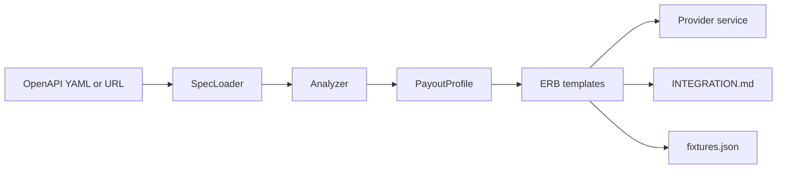

# RubyRoad, for people new to Ruby

## The idea

A shop that wants to send payouts (СБП, cards) talks to a **payment provider** over HTTP: send JSON to create a payout, poll JSON for status, receive a webhook when it finishes. Every provider’s API is a little different, so writing the Space Payments adapter by hand is slow.

**RubyRoad is a Ruby command-line tool.** You give it the provider’s **OpenAPI spec** (a YAML or JSON file that lists every URL, field, and example). It writes a starter integration that matches Space Payments:

```ruby
class Provider::ExampleService < Provider::BaseService
  def check_conditions(operation, request_method)
  def create_request(operation, ...)
  def process_callback(payload)
  def fetch_status(operation)
end
```

1. A Ruby **service** (`output/novapay_service.rb`)
2. **Docs** a teammate can read (`output/INTEGRATION.md`)
3. **Fixtures** from the spec examples (`output/fixtures.json`)

OpenAPI is the menu. RubyRoad is the kitchen that cooks a Ruby service from that menu. There is **no neural net** inside this project — only a parser and ERB templates.

The bundled example is **NovaPay**, a mock payout API, so you can demo this without anyone’s secret keys.

## Run it (about a minute)

You need Ruby 3.2+ and Bundler.

```bash
bundle install
./integrate --spec examples/provider_api.yaml --provider novapay --lang ruby
```

That prints a parse summary and writes three files under `output/`. `rubyroad generate` is the same command.

`SPEC_PATH` can also be a URL. `--out` defaults to `output`. A bad spec fails with a clear error, not a stack trace dump. Unsupported spec bits print `Warning:`.

## What the generated service looks like

Open `output/novapay_service.rb`. Creating a payout looks like this:

```ruby
def create_request(operation, *_args)
  precheck = check_conditions(operation, :create)
  return precheck unless precheck[:success]

  headers = auth_headers
  headers["Idempotency-Key"] = operation.idempotency_key if operation.idempotency_key
  response = client.post("/payouts") do |req|
    req.headers.update(headers)
    req.body = build_payout_payload(operation)
  end
  ...
end
```

Two Ruby things to notice:

- **Keyword-style operation fields** (`operation.amount`, `operation.payout_requisite`) are how Space Payments talks to every provider.
- **`operation.amount` is rubles, the API wants kopecks.** The generator multiplies by 100. It refuses `Float` for money. In computers `0.1 + 0.2` is not exactly `0.3`, and that’s a bad surprise on a payout.

`STATUS_MAP` turns provider words (`completed`) into Space Payments words (`approved`).

## How the generator works



1. **SpecLoader** (`lib/rubyroad/spec_loader.rb`) — reads a file or downloads a URL, parses YAML/JSON.
2. **Analyzer** (`lib/rubyroad/analyzer.rb`) — walks paths, methods, schemas, auth, webhooks.
3. **PayoutProfile** (`lib/rubyroad/integrator.rb`) — decides which operation is create / status / cancel / webhook / balance.
4. **ERB templates** (`lib/rubyroad/templates/service/`) — Ruby’s built-in fill-in-the-blanks format.
5. Files are written under `--out` (default `output/`).

The judge entry is `./integrate`. You run it with `./integrate --spec … --provider … --lang ruby`.

## Ruby words you’ll meet

| Word | What it means here |
| --- | --- |
| **Gem** | A packaged Ruby library. This repo is a gem. |
| **Module / class** | `module Provider` is a namespace. `class NovapayService` is the object Space Payments calls. |
| **Bundler / Gemfile** | The shopping list of libraries: Faraday (HTTP), RSpec (tests), WebMock (fake HTTP). |
| **Faraday** | A friendly HTTP client. The generated service uses it to POST and GET. |
| **ERB** | Templates with Ruby inside. That’s how one generator can emit many different providers. |
| **RSpec** | Tests that read like sentences. |
| **OpenAPI** | Not Ruby. It’s a document format APIs publish. YAML is the usual syntax. |
| **HMAC webhook** | The provider calls *you* when a payout finishes. The generated code checks a signature so strangers can’t fake events. |
| **Idempotency-Key** | A header so a retried create does not pay out twice. |

## Things the project is stubborn about (worth copying)

- **Auth** is inferred from the spec: API key header, Bearer, or Basic.
- **Idempotency-Key** on create calls.
- **Sandbox vs live** base URLs come from the spec’s `servers` list.
- **Webhooks** get a verifier, not just a comment that says “TODO.”
- **Warnings** when a spec feature is unsupported (scored).

## A good order to read the code

You do not need to understand every line. Follow **one** payout all the way through.

1. `DEMO.md` — the commands
2. `examples/provider_api.yaml` — skim `paths` and `components.schemas`, especially `POST /payouts`
3. `output/novapay_service.rb` — `create_request` and `STATUS_MAP`
4. `output/fixtures.json` — the same create + callback examples
5. Then the generator: `spec_loader.rb` → `analyzer.rb` → `integrator.rb` → `templates/service/`

If you can point to the YAML operation, the Ruby method, and the fixture for the same payout, you understand the project.
