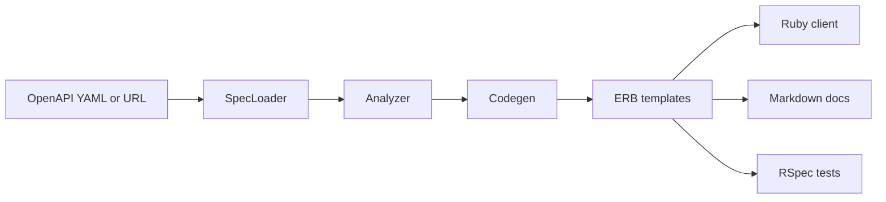

# RubyRoad, for people new to Ruby

## The idea

A shop that wants to take cards talks to a **payment provider** over HTTP: send JSON to charge, send JSON to refund. Every provider’s API is a little different, so writing a Ruby client by hand is slow.

**RubyRoad is a Ruby command-line tool.** You give it the provider’s **OpenAPI spec** (a YAML or JSON file that lists every URL, field, and example). It writes a starter integration:

1. A Ruby **client** you can call (`create_payment`, `create_refund`, …)
2. **Docs** a teammate can read (README, API reference, how auth works)
3. **Tests** that fake the HTTP calls, so you can practice without real cards or real money

OpenAPI is the menu. RubyRoad is the kitchen that cooks a Ruby client from that menu.

The bundled example is a fake provider called **Acme Pay**, so you can demo this without anyone’s secret keys.

## Run it (about a minute)

You need Ruby 3.2+ and Bundler.

```bash
bundle install
bundle exec rubyroad generate examples/acme_pay.openapi.yaml
cd generated/acme_pay
bundle install
bundle exec rspec
```

The last command should be all green. Tests use **WebMock**, which intercepts HTTP, so nothing leaves your machine.

`SPEC_PATH` can also be a URL. `--out` defaults to `generated/<provider>`. A bad spec fails with a clear error, not a stack trace dump.

## What the generated client looks like

Open `generated/acme_pay/lib/acme_pay/client.rb`. A payment looks like this:

```ruby
def create_payment(amount:, currency:, customer_id: nil, idempotency_key: nil, ...)
  path = "/payments"
  body = { amount: normalize_money_amount(amount), currency: normalize_currency(currency, amount) }
  headers = {}
  headers["Idempotency-Key"] = idempotency_key unless idempotency_key.nil?
  payload = request(:post, path, body: body, headers: headers)
  Models::Payment.new(payload)
end
```

Two Ruby things to notice:

- **Keyword arguments** (`amount:`) make the call read like English: `client.create_payment(amount: 2500, currency: "USD")`.
- **`2500` is cents, not dollars.** The generator refuses `Float` for money. In computers `0.1 + 0.2` is not exactly `0.3`, and that’s a bad surprise on a charge.

The response is wrapped in a model (`Models::Payment`) so you get named fields instead of a raw Hash, while still being able to use `result[:id]`.

## How the generator works



1. **SpecLoader** (`lib/rubyroad/spec_loader.rb`) — reads a file or downloads a URL, parses YAML/JSON.
2. **Analyzer** (`lib/rubyroad/analyzer.rb`) — walks paths, methods, schemas, auth, webhooks, and turns them into plain Ruby objects.
3. **Codegen** (`lib/rubyroad/codegen.rb`) — turns those objects into snippets of Ruby and Markdown.
4. **ERB templates** (`lib/rubyroad/templates/`) — Ruby’s built-in fill-in-the-blanks format. `<%= name %>` gets replaced when the file is rendered.
5. Files are written under `--out`.

The CLI entry is `exe/rubyroad`. You run it with `bundle exec rubyroad generate ...`.

## Ruby words you’ll meet

| Word | What it means here |
| --- | --- |
| **Gem** | A packaged Ruby library. This repo is a gem; the generated client is another gem. |
| **Module / class** | `module Rubyroad` is a namespace so names don’t collide. `class Client` is the object you talk to. |
| **Bundler / Gemfile** | The shopping list of libraries: Faraday (HTTP), RSpec (tests), WebMock (fake HTTP). |
| **Faraday** | A friendly HTTP client. The generated `Http` class uses it to POST and GET. |
| **ERB** | Templates with Ruby inside. That’s how one generator can emit many different clients. |
| **RSpec** | Tests that read like sentences: `it "returns a typed result on the happy path"`. |
| **WebMock** | Catches HTTP in tests so you never hit the real Acme Pay (or Stripe) servers. |
| **OpenAPI** | Not Ruby. It’s a document format APIs publish. YAML is the usual syntax. |
| **HMAC webhook** | The provider calls *you* when a payment succeeds. The generated code checks a signature so strangers can’t fake events. |

## Things the project is stubborn about (worth copying)

- **Auth** is inferred from the spec: Bearer token, API key, or Basic.
- **Idempotency-Key** on create calls, so a retried request doesn’t charge twice.
- **Sandbox vs live** base URLs come from the spec’s `servers` list.
- **Webhooks** get a verifier and tests, not just a comment that says “TODO.”

## A good order to read the code

You do not need to understand every line. Follow **one** payment all the way through.

1. `DEMO.md` — the commands
2. `examples/acme_pay.openapi.yaml` — skim `paths` and `components.schemas`, especially `POST /payments`
3. `generated/acme_pay/lib/acme_pay/client.rb` — `create_payment`
4. `generated/acme_pay/spec/` — the test that stubs that same POST
5. Then the generator: `spec_loader.rb` → `analyzer.rb` → `codegen.rb` → `templates/`

If you can point to the YAML operation, the Ruby method, and the RSpec example for the same payment, you understand the project.
